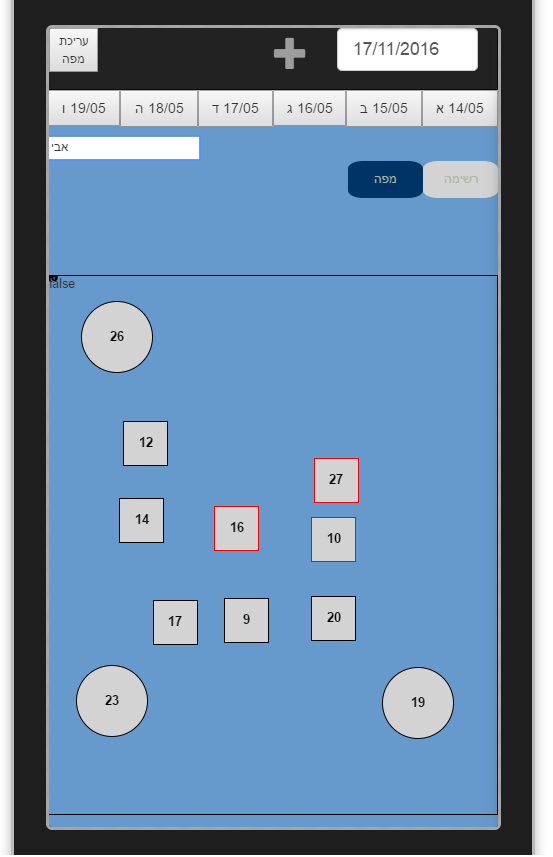
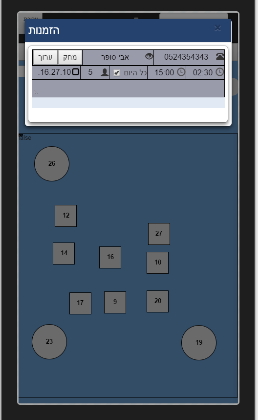

# TheHostess
 

Work In Progress
  

Can view the app <a href="http://thehostess.herokuapp.com">here</a>.  
However for it to be simulated properly it has to be viewed in the ripple emulator chrome plugin (right click on screen and choose emulator>enable.)  
Can also be viewed working partially by opening the developer toolbar(f12) and clicking on the "toggle device toolbar" icon (and clicking on the date bar in the app to rerender the tables).  

Some features don't work yet and some need to be updated and caught up to the latest changes in code. 
For now it is best to view the tables - change the date in the date bar, click on a table to view the reservations assigned to it. 
Tables can have multiple reservations and reservations can have multiple tables.  
  

   
Features to be updated to work with latest changes: 
- editing a map - make sure dragging tables and resizing works properly. also change the way eventlistener are attached to buttons. 
- make sure adding a new table is working properly. 
 
Features to add: 
- editing and removing a reservation. 
 
Bugs to be fixed: 
- dates nav bar does not change according to date bar change.  

